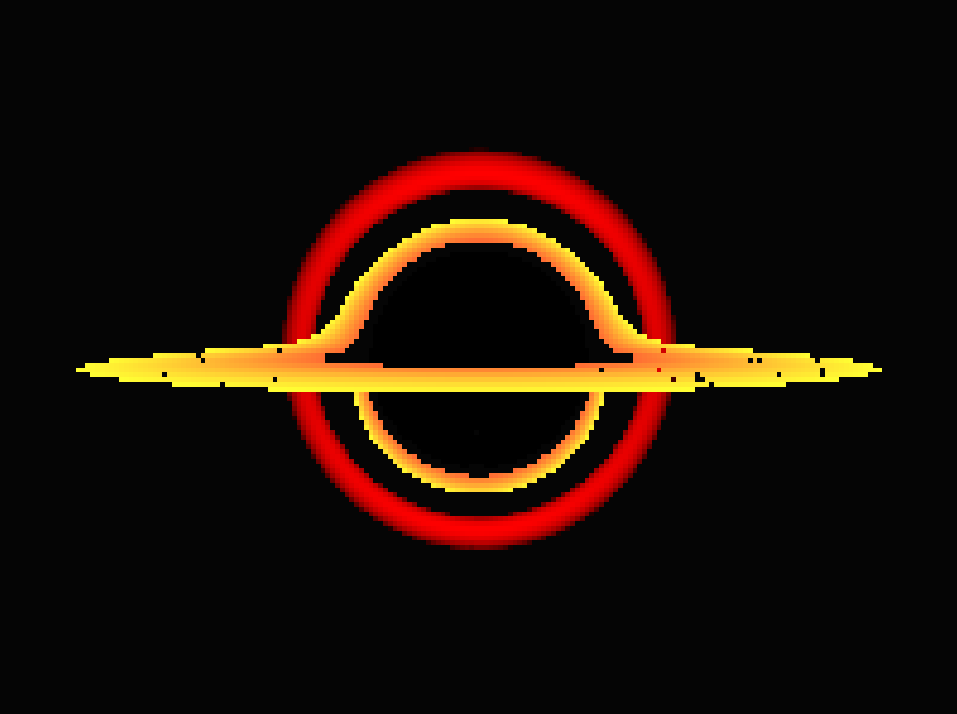

# Black Hole Simulation



Black Hole Simulation using SDL3 GPU with compute shaders

### Building

#### Windows

```bash
git clone https://github.com/jsoulier/black_hole_simulation --recurse-submodules
cd black_hole_simulation
mkdir build
cd build
cmake ..
cmake --build . --parallel 8 --config Release
cd bin
./black_hole_simulation.exe
```

#### Linux

```bash
git clone https://github.com/jsoulier/black_hole_simulation --recurse-submodules
cd black_hole_simulation
mkdir build
cd build
cmake .. -DCMAKE_BUILD_TYPE=Release
cmake --build . --parallel 8
cd bin
./black_hole_simulation
```

### References

- [Youtube Video](https://www.youtube.com/watch?v=8-B6ryuBkCM) by Kavan